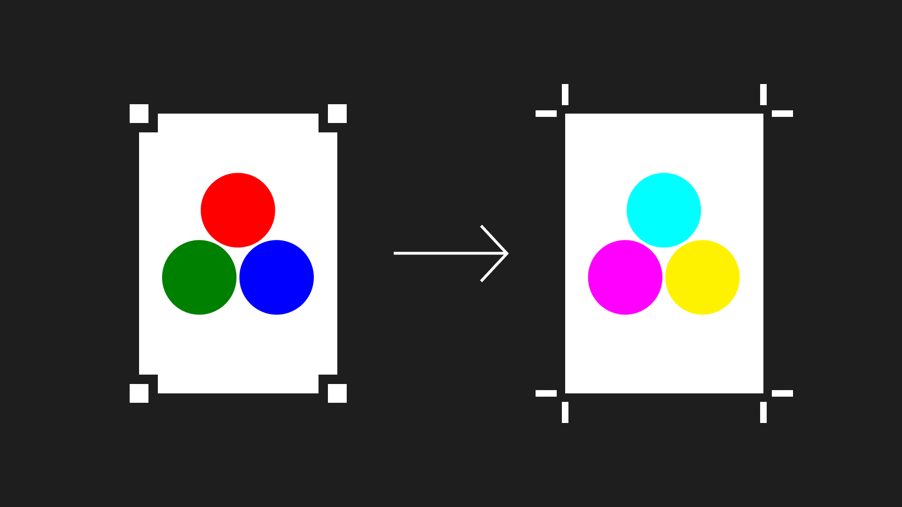

# Open Print

*Export Figma frames as print-ready CMYK PDFs, right inside Figma.*

[](LICENSE)



## Features

- **Vector CMYK PDFs**: vectors and text stay sharp, colour is converted with your printer’s profile, and no RGB is left in the file.
- **Print sizes built in**: create frames at A0 to A6, DL, business card, 50 × 70 and 70 × 100 cm posters, Letter or Tabloid, already at the right Figma size.
- **Bleed and crop marks**: add bleed of any size and registration marks, with trim and bleed boxes set in the PDF.
- **Private by design**: conversion runs inside the plugin. No server, no uploads, no analytics.

## Install

1. Download `open-print-latest.zip` from the [latest build](https://github.com/davidmarqu3s/open-print/releases/tag/latest-build) and extract it to a folder you’ll keep.
2. In Figma desktop, choose **Plugins → Development → Import plugin from manifest…** and select the extracted `manifest.json`.

The build is updated with every change to `main` and may be less stable than a versioned release.

## Use

Select up to 32 frames or components, run **Plugins → Development → Open Print**, choose a CMYK profile and click **Export CMYK PDF**. Frames export at Figma’s 72 units per inch, or at a size you type.

## What’s supported

- **Vectors and text** stay vector. Text is exported as outlines.
- **Colour** is converted from sRGB with relative colorimetric and black point compensation. No RGB is left in the file.
- **Images** are converted to CMYK without downsampling, with a warning below 300 ppi at print size.
- **Gradients** export as vector CMYK.
- **Shadows, blurs, noise and texture** are rendered as 300 ppi images. Other effects, such as glass, are listed before export.
- **Pure black** (#000000) prints as 100% K and overprints. This can be turned off.
- **PDF/X-4** is on by default when a profile is chosen, with trim and bleed boxes.
- **Profiles:** 15 common European, US and Japanese CMYK profiles, plus custom ICC import.
- **Not supported yet:** PDF/X-1a, spot colours, and overprint other than pure black.

Exporting never changes your Figma layers. Only adding bleed edits the file.

## Privacy and network

On your first export, the plugin downloads a pinned Ghostscript engine from this repository and checks its SHA-256 checksum before running it. That is its only network request: your artwork and PDFs are never uploaded, and there are no analytics.

## Build and test

Requires Node 18 or later, with nothing to install:

```sh
npm run build
npm test
```

See [docs/development.md](docs/development.md) for custom profile builds, rebuilding the engine and releasing.

## Licences

The plugin is licensed under [GNU AGPL v3](LICENSE).

- **Ghostscript 10.07.1:** AGPL. The complete corresponding source is in the `-source.zip` file attached to every [release](https://github.com/davidmarqu3s/open-print/releases), including the latest build. It is the unmodified [Ghostscript 10.07.1 source](https://github.com/ArtifexSoftware/ghostpdl-downloads/releases/download/gs10071/ghostscript-10.07.1.tar.gz) plus the build files in `vendor/engine-source/`.
- **WASM build:** based on [J0shua-code/pdf-tools](https://github.com/J0shua-code/pdf-tools) at commit `51131fe`; its sources are in `vendor/engine-source/`.
- **pdf-lib 1.17.1** and **js-sha256 0.11.1:** MIT.
- **ICC profiles:** each keeps its supplier’s own terms. See [profile sources and notices](vendor/profiles/README.md).

If you redistribute a modified version, keep these licences and provide the corresponding source.
